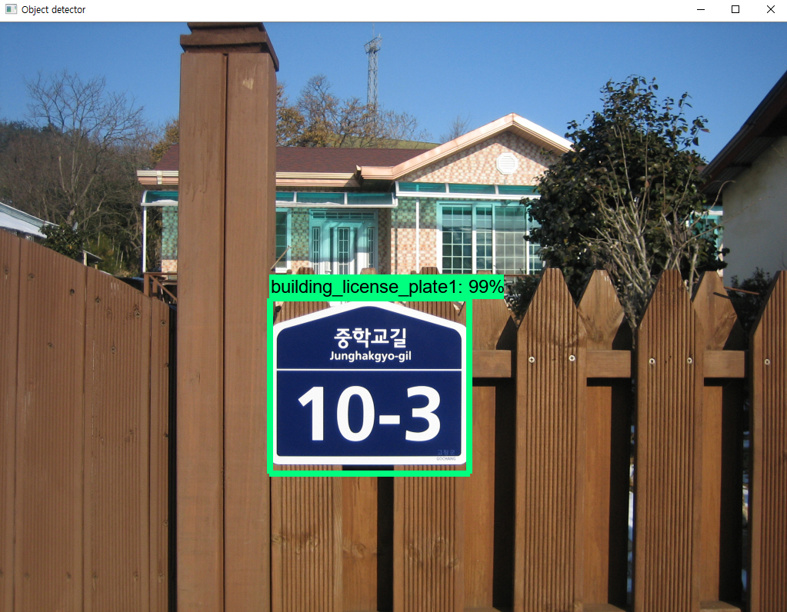
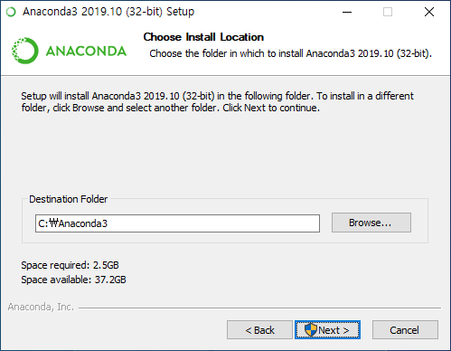
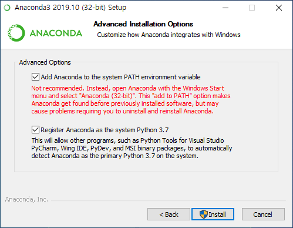
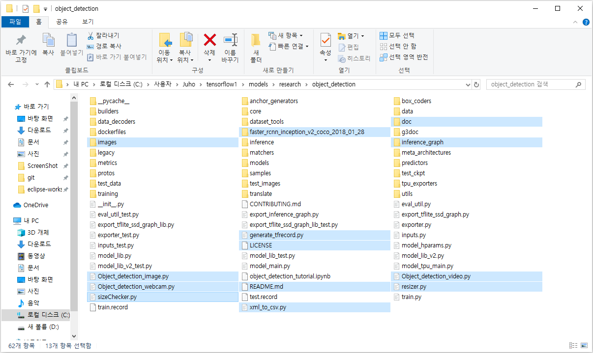
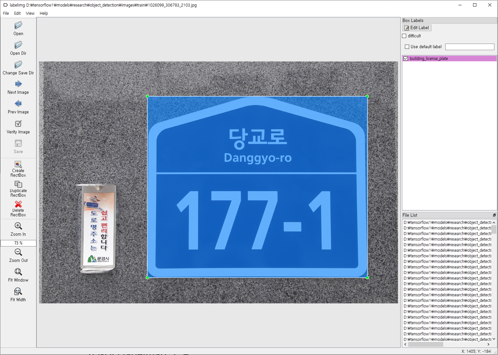
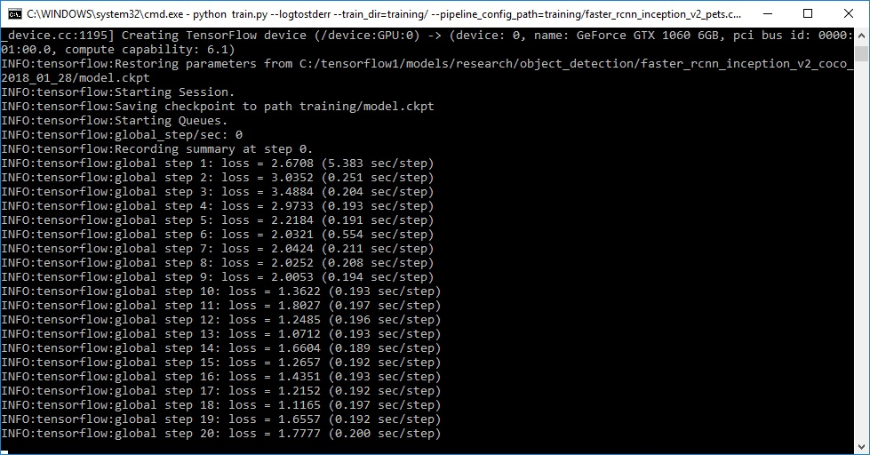

# Detecting Building license plate using TensorFlow Object Detection
## Brief Summary
***last updated: 24/02/2020 with Tensorflow v1.15***  
  
This repertory is a deep learning project that creates models that recognize building license plates as part of Inha University's Winter School project. This project ran on Windows, and all configuration is Windows based. Participants in this project are Lee Ju-ho and Park Ki-soo.  
  
This repository only covers creating models that recognize building plates using Python code on PC, and the rest of the process is covered elsewhere. This repository provides all the files needed to train building plates detector.  
  
This readme describes every steps required to get going with obect detection classifier.  
It also describes how to replace the files with your own files to train a detection classifier for whatever you want. It also has Python scripts to test your classifier out on an image, video, or webcam feed.  
  
This project is inspired by "[How To Train an Object Detection Classifier for Multiple Objects Using TensorFlow (GPU) on Windows 10](https://github.com/EdjeElectronics/TensorFlow-Object-Detection-API-Tutorial-Train-Multiple-Objects-Windows-10#1-install-anaconda-cuda-and-cudnn)"  
  
  
  
## Introduction

The purpose of this project is to create a tensorflow model that can detects building license plate from the image, to make an application that automatically recognizes addresses when photos are taken.  
  
The reason why we need to train a model that recognizes a license plate is that in general, when a picture is taken, it most likely contains other letters besides the license plate. So we should recognize the license plate first, and then recognize the letters.  
In this progress, we will create a model that recognizes building license plates using TensorFlow Object Detection api.  
  
We will use TensorFlow-GPU v1.15. TensorFlow-GPU allows your PC to use the video card to provide extra processing power while training.  
You could use only cpu to train the model but it would take much longer times. If you use CPU-only TensorFlow, you don't need to install CUDA and cuDNN in Step 1.  
  
## Steps
### 1. Install Anaconda, CUDA, and cuDNN

First, you should install Anaconda. You can get [Anaconda here](https://www.anaconda.com/distribution/). Click Python 3.7 version download and run the exe.  
  
Set the file path to install, and click next.  
  
  
  
Check all the checkbox and click install.  
  
  
 

After installing Anaconda, you should install CUDA and cuDNN. To use CUDA, you must have a NVIDIA graphics card that supports CUDA. You can check that your graphics card supports CUDA or not at [here](https://www.geforce.com/hardware/technology/cuda/supported-gpus?field_gpu_type_value=all). If you don't have CUDA supported graphics card, you have to use TensorFlow-CPU only. Then you can skip this step.  
  
If you checked your graphics card supports CUDA, now you should install CUDA 10.1 version. Make sure that you installed 10.1 version instead 10.2 version(latest version). At the time of this writing TensorFlow do not support 10.2 CUDA. Check the version of CUDA that TensorFlow supports. You can get [CUDA 10.1 here](https://developer.nvidia.com/cuda-10.1-download-archive-base?target_os=Windows&target_arch=x86_64&target_version=10&target_type=exelocal).  
I recommend you to download local version. Network version may fail during installation. If you have failed during install, it 
might have conflicted with graphics driver. If you failed, remove your graphics driver and try again.  
  
After installing CUDA, get [cuDNN here](https://developer.nvidia.com/rdp/cudnn-archive). To get cuDNN, you have to join NVIDIA membership. You can download cuDNN after sign in the site. Download cuDNN and extract all files in 'cuda' folder to your CUDA installed path. If you installed CUDA at default path, it would be here "C:\Program Files\NVIDIA GPU Computing Toolkit\CUDA\v10.1".
  

### 2. Install TensorFlow and update Anaconda environment

After step 1, now you should install tensorflow-gpu and conda packages. From the Start menu in Windows, search for the Anaconda Prompt utility, right click on it, and click “Run as Administrator”. If Windows asks you if you would like to allow it to make changes to your computer, click Yes. And update conda by this command.
<pre><code>conda update -n base conda</code></pre>
Next, update all installed Python packages.
<pre><code>conda update --all</code></pre>
Now, install TensorFlow-gpu 1.15 by this command.
<pre><code>pip install tensorflow-gpu==1.15</code></pre>
If you don't have a graphics card or didn't install CUDA, install TensorFlow-cpu only version.
<pre><code>pip install tensorflow==1.15</code></pre>
After install now you are ready to use TensorFlow!
  
#### 2a. Download TensorFlow Object Detection API repository from GitHub

Create a folder directly in C: and name it “tensorflow1”. This working directory will contain the full TensorFlow object detection framework, as well as your training images, training data, trained classifier, configuration files, and everything else needed for the object detection classifier.  
  
Download the full TensorFlow object detection repository located at https://github.com/tensorflow/models by clicking the “Clone or Download” button and downloading the zip file. Open the downloaded zip file and extract the “models-master” folder directly into the C:\tensorflow1 directory you just created. Rename “models-master” to just “models”.

*Note : The TensorFlow models repository's code (which contains the object detection API) is continuously updated by the developers. Sometimes they make changes that break functionality with old versions of TensorFlow. It is usually best to use the latest version of TensorFlow and download the latest models repository. At the time of this writing TensorFlow v1.15 is best to use the latest TensorFlow models repository's code, but if you have problem with using this code try to update your TensorFlow version or download orlder version of TensorFlow models repository. [TF v1.13](https://github.com/tensorflow/models/tree/r1.13.0)*
  
#### 2b. Download the Faster-RCNN-Inception-V2-COCO model from TensorFlow's model zoo  

TensorFlow provides several object detection models (pre-trained classifiers with specific neural network architectures) in its [model zoo](https://github.com/tensorflow/models/blob/master/research/object_detection/g3doc/detection_model_zoo.md). Some models (such as the SSD-MobileNet model) have an architecture that allows for faster detection but with less accuracy, while some models (such as the Faster-RCNN model) give slower detection but with more accuracy.  
  
You can choose which model to train your objection detection classifier on. If you are planning on using the object detector on a device with low computational power (such as a smart phone or Raspberry Pi), use the SDD-MobileNet model. If you will be running your detector on a decently powered laptop or desktop PC, use one of the RCNN models.  
  
In this project we will use the Faster-RCNN-Inception-V2 model. [Download the model here](http://download.tensorflow.org/models/object_detection/faster_rcnn_inception_v2_coco_2018_01_28.tar.gz). Open the downloaded faster_rcnn_inception_v2_coco_2018_01_28.tar.gz file and extract the faster_rcnn_inception_v2_coco_2018_01_28 folder to the C:\tensorflow1\models\research\object_detection folder.  
  
#### 2c. Download this repository from GitHub  

Download the full repository located on this page (scroll to the top and click Clone or Download) and extract all the contents directly into the C:\tensorflow1\models\research\object_detection directory. (You can overwrite the existing "README.md" file.) This establishes a specific directory structure that will be used for the rest of the tutorial.
  
At this point, your \object_detection folder should look like this image:  
  
  
  
This repository contains all images to train building license plate detector, .csv files and already trained models too. You can test my trained building license detector after step 2 is all completed by running Object_detection_image.py script. You can ignore the \doc folder and its files; they are just there to hold the images used for this readme.  
  
If you want to train your own object detector, delete the following files (do not delete the folders):  
- All files in \object_detection\images\train and \object_detection\images\test
- The “test_labels.csv” and “train_labels.csv” files in \object_detection\images
- All files in \object_detection\training
- All files in \object_detection\inference_graph  

After delete all these files you can use your own images to train whatever you want. Following steps will explain how to train your own object detector.  
  
#### 2d. Set up Anaconda environment for Object Detection API  

We have updated Anaconda environment at the beginning of step 2. It has no problem using TensorFlow only. But to use Object Detection API you need to do some more settings.  
  
Frist, run Anaconda promt as Adminitrator and type this command to install protobuf package.
<pre><code>conda install -c anaconda protobuf</code></pre>
Then, install opencv-python by this command.
<pre><code>pip install opencv-python</code></pre>

#### 2e. Configure PYTHONPATH environment variable

A PYTHONPATH variable must be created that points to the \models, \models\research, and \models\research\slim directories. Do this by issuing the following commands. (from any directory)
<pre><code>set PYTHONPATH=C:\tensorflow1\models;C:\tensorflow1\models\research;C:\tensorflow1\models\research\slim</code></pre>
*Note : Every time Anaconda prompt is exited, the PYTHONPATH variable might be reset and needs to be set up again. You can use "echo %PYTHONPATH% to see if it has been set or not. Or if you see "ImportError: No module named 'nets'" error, then you have to reset your PYTHONPATH.*
  
#### 2f. Compile Protobufs and run setup.py

Next, compile the Protobuf files, which are used by TensorFlow to configure model and training parameters. In the Anaconda Command Prompt, change directories to the \models\research directory.
<pre><code>cd C:\tensorflow1\models\research</code></pre>
Then copy and paste the following command into the command line and press Enter.
<pre><code>protoc object_detection/protos/*.proto --python_out=.</code></pre>
This creates a name_pb2.py file from every name.proto file in the \object_detection\protos folder.  
  
Finally, run the following commands from the C:\tensorflow1\models\research directory:
<pre><code>python setup.py build  
python setup.py install</code></pre>
The TensorFlow Object Detection API is now all set up to use pre-trained models for object detection, or to train a new one. Now you can try my trained building license plate detector. To try this, go to \object_detector folder and type
<pre><code>idle</code></pre>
At the Python Shell, click File -> Open and select Object_detection_image.py and open it. Now change the image name that you want to test in this code.
<pre><code># Name of the directory containing the object detection module we're using
MODEL_NAME = 'inference_graph'
IMAGE_NAME = 'test1.jpg'  # change here</code></pre>  
  
### 3. Gather and Label Pictures.

Now that the TensorFlow Object Detection API is all set up and ready to go, we need to provide the images it will use to train a new detection classifier.  
  
#### 3a. Gather Pictures

TensorFlow needs hundreds of images of an object to train a good detection classifier. To train a robust classifier, the training images should have random objects in the image along with the desired objects, and should have a variety of backgrounds and lighting conditions. There should be some images where the desired object is partially obscured, overlapped with something else, or only halfway in the picture.  
  
We have gathered 267 pictures of building license plate. Each picture was taken under various angles and light sources. The photos are all labeled and placed in the image folder. Larger images can take longer to train. If you want a reasonable amount of time, I recommend reducing it to around 200kb. You can use the resizer.py script in this repository to reduce the size of the images.  
  
After you have all the pictures you need, move 20% of them to the \object_detection\images\test directory, and 80% of them to the \object_detection\images\train directory. Make sure there are a variety of pictures in both the \test and \train directories.  
  
#### 3b. Label Pictures

The most boring time has come in the process of creating an object detector. You should label all the pictures in the train folder and the pictures in the test folder. The labelImg program is recommended for labeling. [Here is the download link](https://www.dropbox.com/s/tq7zfrcwl44vxan/windows_v1.6.0.zip?dl=1).  
  
You can also get it at GitHub.  
[LabelImg GitHub Link](https://github.com/tzutalin/labelImg)  
  

Download and unzip the file. Run the program and click 'Open Dir' to label both the test and train folders in the \object_detection\ image folder.

  
  
LabelImg saves a .xml file containing the label data for each image. These .xml files will be used to generate TFRecords, which are one of the inputs to the TensorFlow trainer. Once you have labeled and saved each image, there will be one .xml file for each image in the \test and \train directories.  
  
### 4. Generate Training Data

With the images labeled, it’s time to generate the TFRecords that serve as input data to the TensorFlow training model.  
  
First, the image .xml data will be used to create .csv files containing all the data for the train and test images. From the \object_detection folder, issue the following command in the Anaconda command prompt.
<pre><code>python xml_to_csv.py</code></pre>
This creates a train_labels.csv and test_labels.csv file in the \object_detection\images folder.  
  
Next, open the generate_tfrecord.py file in a text editor. Replace the label map starting at line 31 with your own label map.
<pre><code># TO-DO replace this with label map
def class_text_to_int(row_label):
    if row_label == 'building_license_plate1':
        return 1
    elif row_label == 'building_license_plate2':
        return 2
    else:
        return 0</code></pre>

Change this part to match the object labels you did.  
  
Then, generate the TFRecord files by issuing these commands from the \object_detection folder.
<pre><code>python generate_tfrecord.py --csv_input=images\train_labels.csv --image_dir=images\train --output_path=train.record
python generate_tfrecord.py --csv_input=images\test_labels.csv --image_dir=images\test --output_path=test.record</code></pre>
These generate a train.record and a test.record file in \object_detection. These will be used to train the new object detection classifier.  
  
### 5. Create Label Map and Configure Training
#### 5a. Label map

The label map tells the trainer what each object is by defining a mapping of class names to class ID numbers. Use a text editor to create a new file and save it as labelmap.pbtxt in the C:\tensorflow1\models\research\object_detection\training folder. (Make sure the file type is .pbtxt, not .txt !) In the text editor, copy or type in the label map in the format below (the example below is the label map for building liecense plate detector)
<pre><code>item {
  id: 1
  name: 'building_license_plate1'
}

item {
  id: 2
  name: 'building_license_plate2'
}</code></pre>
#### 5b. Configure training

Now navigate to C:\tensorflow1\models\research\object_detection\samples\configs and copy the faster_rcnn_inception_v2_pets.config file into the \object_detection\training directory. Then, open the file with a text editor. There are several changes to make to the .config file, mainly changing the number of classes and examples, and adding the file paths to the training data.  
  
Make the following changes to the faster_rcnn_inception_v2_pets.config file.  
  
*Note: The paths must be entered with single forward slashes (NOT backslashes), or TensorFlow will give a file path error when trying to train the model! Also, the paths must be in double quotation marks ( " ), not single quotation marks ( ' ).*  
- Line 9. Change num_classes to the number of different objects you want the classifier to detect. if you made three object labels, it would be num_classes : 3 .
- Line 106. Change fine_tune_checkpoint to
  + fine_tune_checkpoint : "C:/tensorflow1/models/research/object_detection/faster_rcnn_inception_v2_coco_2018_01_28/model.ckpt"
- Lines 123 and 125. In the train_input_reader section, change input_path and label_map_path to
  + input_path : "C:/tensorflow1/models/research/object_detection/train.record"
  + label_map_path: "C:/tensorflow1/models/research/object_detection/training/labelmap.pbtxt"
- Line 130. Change num_examples to the number of images you have in the \images\test directory.
- Lines 135 and 137. In the eval_input_reader section, change input_path and label_map_path to:
  + input_path : "C:/tensorflow1/models/research/object_detection/test.record"
  + label_map_path: "C:/tensorflow1/models/research/object_detection/training/labelmap.pbtxt"
  
Save the file after the changes have been made. That’s it! The training job is all configured and ready to go!  
  
### 6. Run the Training

First, go to \object_detection\config folder and find train.py file. Copy it and paste to \object_detection folder. We will train by this file so make sure that you have this file in you object_detection folder.  
  
 From the \object_detection directory, issue the following command to begin training
 <pre><code>python train.py --logtostderr --train_dir=training/ --pipeline_config_path=training/faster_rcnn_inception_v2_pets.config</code></pre>
If everything has been set up correctly, TensorFlow will initialize the training. The initialization can take up to 30 seconds before the actual training begins. When training begins, it will look like this  
  
  
  
Each step of training reports the loss. It will start high and get lower and lower as training progresses. For my training on the Faster-RCNN-Inception-V2 model, it started at about 3.0 and quickly dropped below 0.8. I recommend allowing your model to train until the loss consistently drops below 0.05, which will take about 40,000 steps. The loss numbers will be different if a different model is used.  
  
You can view the progress of the training job by using TensorBoard. To do this, open a new instance of Anaconda Prompt, activate the tensorflow1 virtual environment, change to the C:\tensorflow1\models\research\object_detection directory, and issue the following command.
<pre><code>tensorboard --logdir=training</code></pre>
This will create a webpage on your local machine at YourPCName:6006, which can be viewed through a web browser. The TensorBoard page provides information and graphs that show how the training is progressing. One important graph is the Loss graph, which shows the overall loss of the classifier over time.  
  
The training routine periodically saves checkpoints about every five minutes. You can terminate the training by pressing Ctrl+C while in the command prompt window.  
  
### 7. Export Inference Graph

Now that training is complete, the last step is to generate the frozen inference graph (.pb file). From the \object_detection folder, issue the following command, where “XXXX” in “model.ckpt-XXXX” should be replaced with the highest-numbered .ckpt file in the training folder.
<pre><code>python export_inference_graph.py --input_type image_tensor --pipeline_config_path training/faster_rcnn_inception_v2_pets.config --trained_checkpoint_prefix training/model.ckpt-XXXX --output_directory inference_graph</code></pre>
This creates a frozen_inference_graph.pb file in the \object_detection\inference_graph folder. The .pb file contains the object detection classifier.  
  
### 8. Use Your Own Trained Object Detection Classifier!

The object detection classifier is all ready to go!  
Before running the Python scripts, you need to modify the NUM_CLASSES variable in the script to equal the number of classes you want to detect.  
  
To test your object detector, move a picture of the object or objects into the \object_detection folder, and change the IMAGE_NAME variable in the Object_detection_image.py to match the file name of the picture. Alternatively, you can use a video of the objects (using Object_detection_video.py), or just plug in a USB webcam and point it at the objects (using Object_detection_webcam.py).  
  
To run any of the scripts, type “idle” in the Anaconda Command Prompt (with the “tensorflow1” virtual environment activated) and press ENTER. This will open IDLE, and from there, you can open any of the scripts and run them.  
  
If you've followed along well, you've made an excellent your own object detector. Congratulations!
# BuildingLicensePlate
# BuildingLicensePlate
# BuildingLicensePlate
